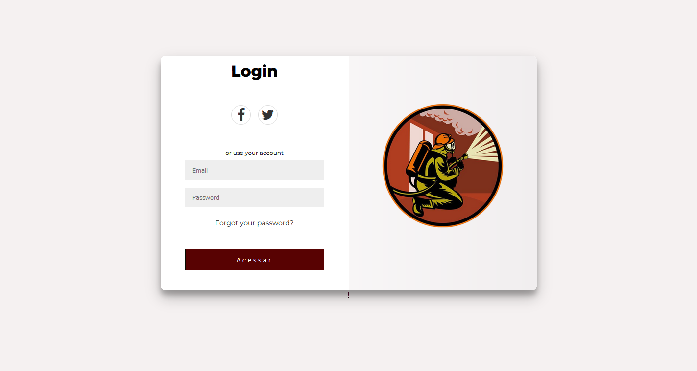

<h1 align="center">FireCenterHelp </h1>

<table border="1">
 
<h2>Equipe Do Projeto<h2>
    <tr>
        <td>Nome</td>
        <td>Idade</td>
        <td>Profissão</td>
    </tr>
    <tr>
        <td>João Vitor</td>
        <td>20</td>
        <td>Programador</td>
    </tr>
    <tr>
        <td>Marcus</td>
        <td>18</td>
        <td>Programador</td>
    </tr>
    <tr>
        <td>Nicolas</td>
        <td>26</td>
        <td>Scrum master</td>
    </tr>
</table>

<table border="1">
    <h2>Tecnologias utilizadas<h2>
    <tr>
        <td>Java</td>
        <td>MySQL</td>
    </tr>
    <tr>
        <td>HTML</td>
        <td>CSS</td>
    </tr>
    <tr>
        <td>JavaScript</td>
        <td>Ionic</td>
    </tr>
</table>
 :construction: Projeto em construção :construction:
